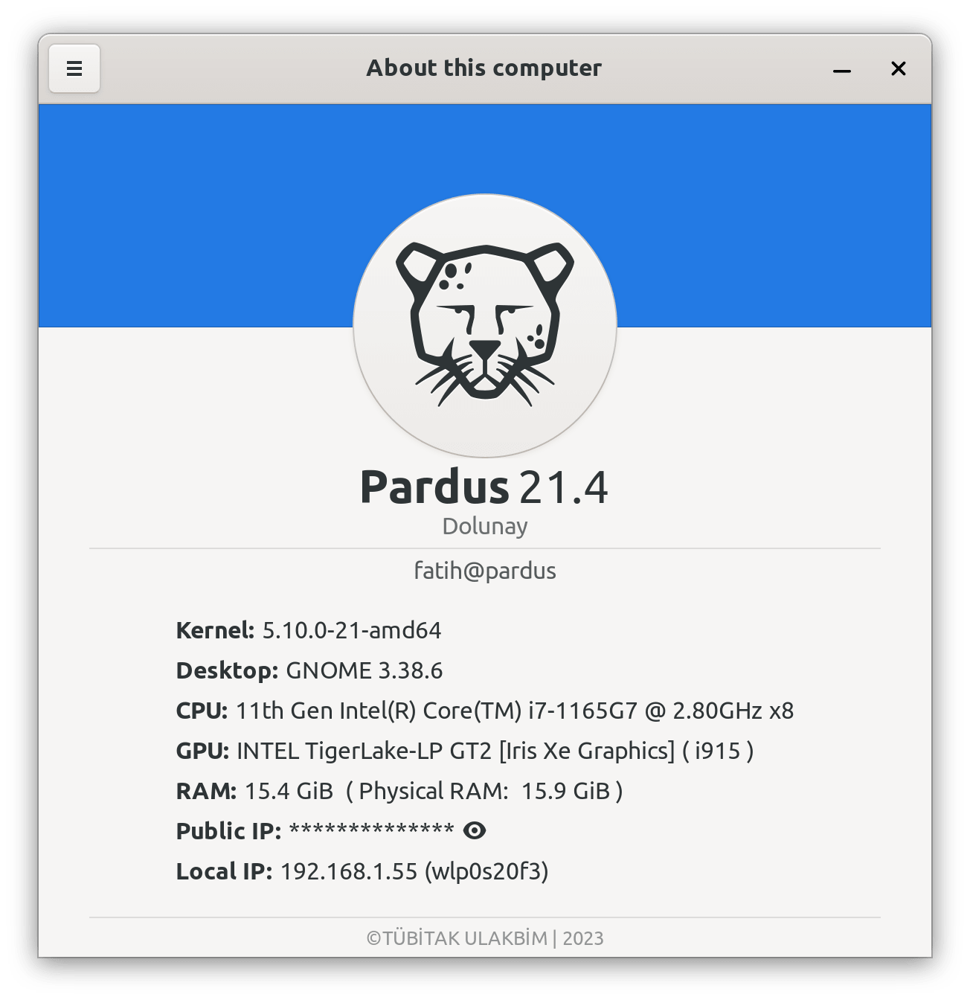
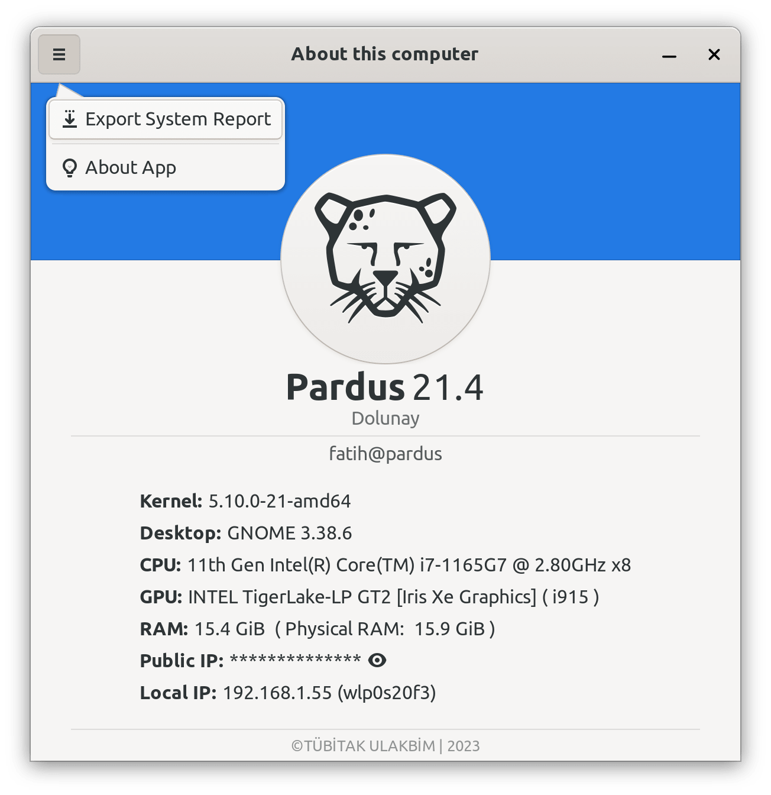

# Pardus About

Pardus About is an application that show summary information about the PC.

It is currently a work in progress. Maintenance is done by <a href="https://www.pardus.org.tr/">Pardus</a> team.

[](https://repology.org/project/pardus-about/versions)

### **Dependencies**

This application is developed based on Python3 and GTK+ 3. Dependencies:
```bash
gir1.2-glib-2.0 gir1.2-gtk-3.0 python3-requests python3-gi lsb-release mesa-utils pciutils
```

### **Run Application from Source**

Install dependencies
```bash
sudo apt install gir1.2-glib-2.0 gir1.2-gtk-3.0 python3-requests python3-gi lsb-release mesa-utils pciutils
```
Clone the repository
```bash
git clone https://github.com/pardus/pardus-about.git ~/pardus-about
```
Run application
```bash
python3 ~/pardus-about/src/Main.py
```

### **Build deb package**

```bash
sudo apt install devscripts git-buildpackage
sudo mk-build-deps -ir
gbp buildpackage --git-export-dir=/tmp/build/pardus-about -us -uc
```

### **Screenshots**




